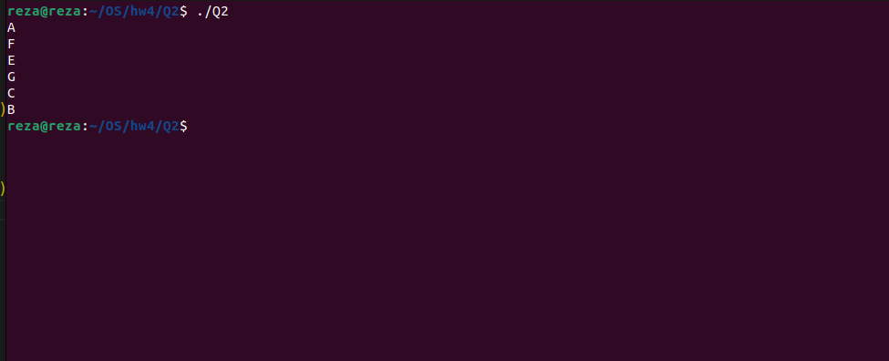

# A-F-C Program
- This program consists of two threads (p1 and p2) that are synchronized using semaphores to control the order of their execution. The goal is to print the following sequence:

```terminal
A
F
E
G
C
B
```


## Code Description
- p1: This thread waits for sem_two, prints "F," signals sem_one, and then prints "E" and "G."

- p2: This thread prints "A," signals sem_two, waits for sem_one, prints "C," signals sem_three, and finally prints "B."

## Building and Running the Program
- To build and run the program, use the provided Makefile:

```terminal
make
./Q2

```
