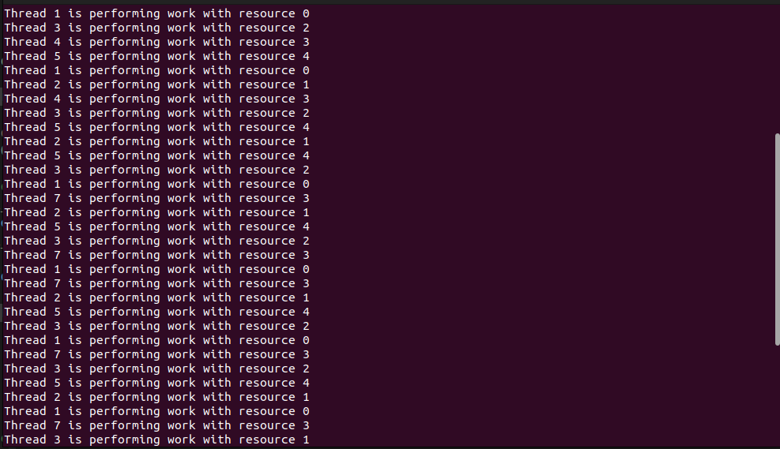

# ResourceManager Program

This program simulates the allocation of limited resources to multiple threads.
Each thread performs work with an allocated resource and then releases it.

## How to Run

1. Compile the program using the provided Makefile:

    ```bash
    make
    ```

2. Run the executable:

    ```bash
    ./Q4
    ```

3. To stop the program, you may need to manually terminate it (e.g., press Ctrl+C).

4. Clean up the generated files:

    ```bash
    make clean
    ```

Ensure that you have GCC installed on your system for compilation.

## out put

