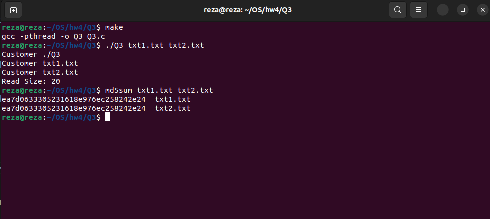

# File Copy Program
This program copies the contents of a source file to a destination file using two threads, one for reading and one for writing. Mutexes are used to synchronize access to the shared buffer.
## How to Run
1. Compile the program using the provided Makefile:
    ```bash
    make
    ```
2. Run the executable with source and destination file paths:

    ```bash
    ./Q3 <source_file_path> <destination_file_path>
    ```
3. To check that the file was transferred correctly, use the following command:

    ```bash
    md5sum <source_file> <dest_file>
    ```

   The output of this command should be the same for the source and destination files.
4. Clean up the generated files:

    ```bash
    make clean
    ```
# output

