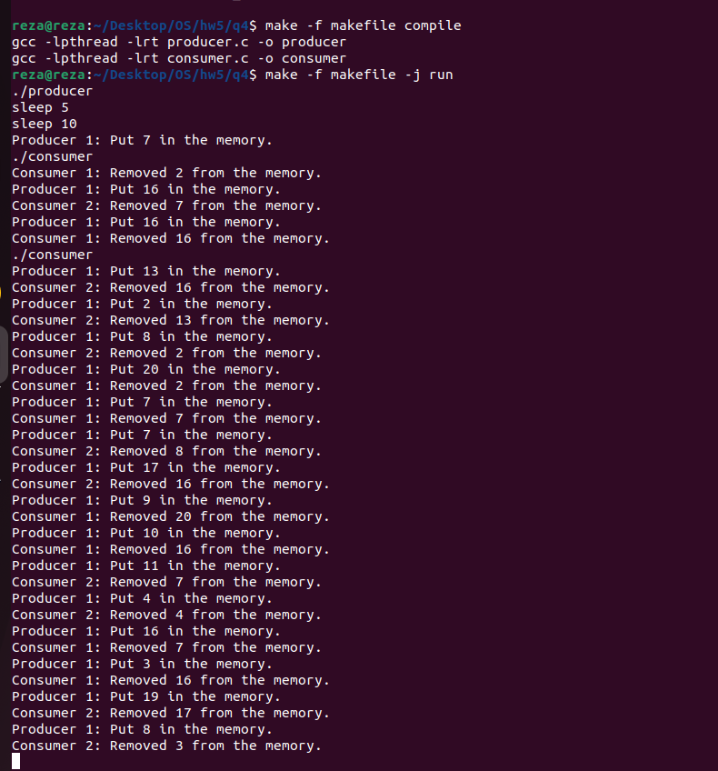
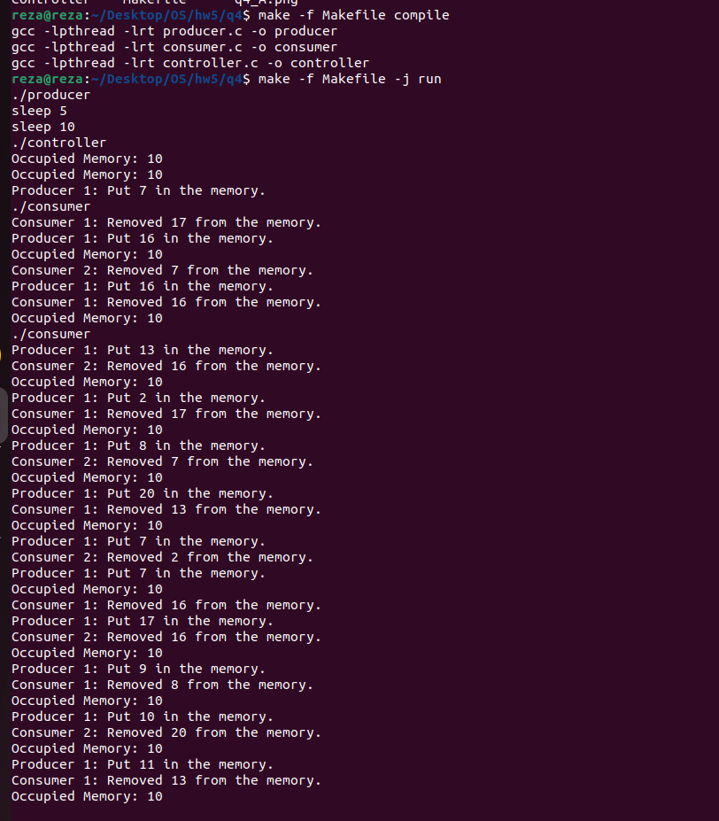

# Producer-Consumer 


## Compilation

### Producer and Consumer Only

```bash
make -f makefile compile

make -f makefile -j run

```

### Producer-Consumer Controller System

This system provides two different configurations:


To compile and run this configuration, use the following commands:

```bash
make -f Makefile compile 

make -f Makefile -j run
```

