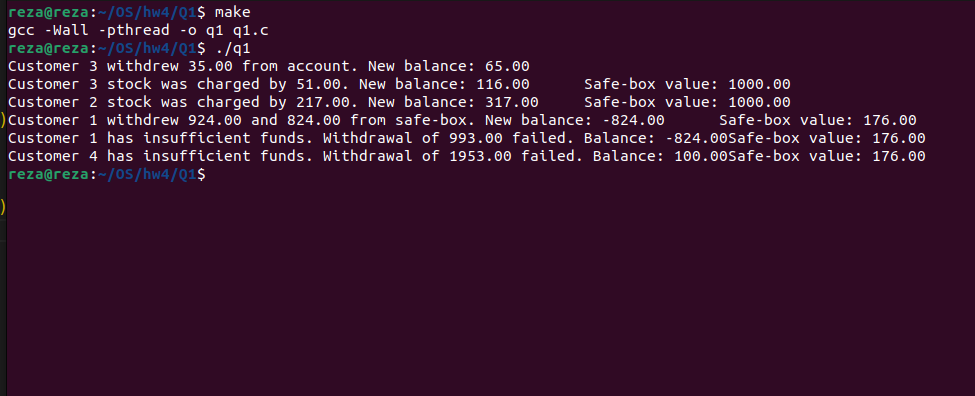

# Code Structure

## Global Variables

- arr: An array to store the account balance of each customer.
- safeBox: A shared variable representing the balance of the safe box.
- account_mutex: An array of mutexes, each associated with a customer's account balance.
- safebox_mutex: An array of mutexes, each associated with the safe box.

## Transaction Structure
 - transaction_t: A structure representing a transaction, including the transaction amount and the customer ID.

## Withdraw Function
 
 The withdraw function performs a withdrawal transaction. It locks the customer's account mutex, checks if there are sufficient funds in the account, and updates the balance accordingly. If the account balance is insufficient, it locks the associated safe box mutex and checks if there are enough funds in the safe box. If so, it withdraws the remaining amount from the safe box and updates both the account and safe box balances.


## Deposit Function

The deposit function handles deposit transactions. Similar to the withdraw function, it locks the customer's account mutex and updates the balance. If the account balance is negative (indicating an existing debt), it locks the associated safe box mutex, checks if there are enough funds in the safe box, and pays off the debt. Finally, it prints the new balances and unlocks the mutexes.

# Execution

To execute the program:

- Compile the code using the make command.
- Run the executable (./q1).

# Mutex Usage in Banking System Code

```c
double arr[NUM_CUSTOMERS + 1];
pthread_mutex_t safebox_mutex[NUM_CUSTOMERS + 1];
pthread_mutex_t account_mutex[NUM_CUSTOMERS + 1];
```
## Mutex Usage in withdraw Function

In the withdraw function, the account_mutex is locked to ensure exclusive access to the customer's account balance. Depending on the available funds, the function either updates the account balance or, if necessary, locks the associated safebox_mutex to access the shared safe box variable.

## Mutex Usage in deposit Function

In the deposit function, similar to withdraw, the account_mutex is locked to ensure exclusive access to the customer's account balance. The function then checks the account balance and, if necessary, locks the associated safebox_mutex to access the shared safe box variable. It prints the updated balances and unlocks the mutexes accordingly.

# output


